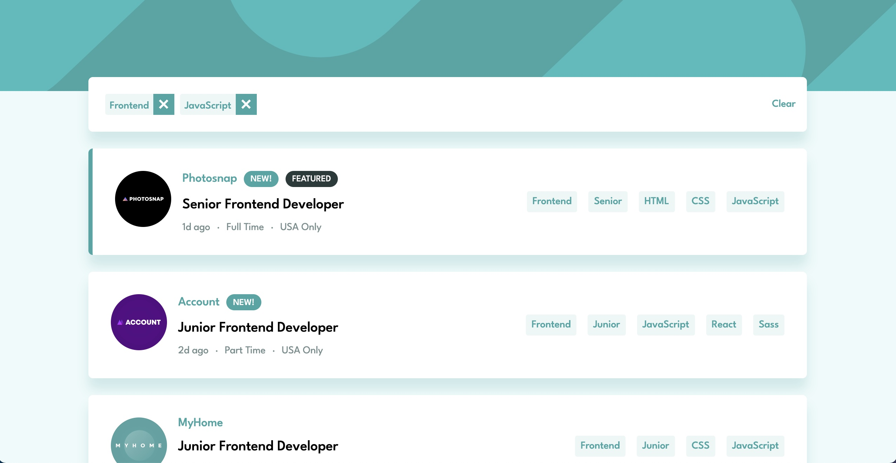

# Frontend Mentor - Job listings with filtering solution

This is a solution to the [Job listings with filtering challenge on Frontend Mentor](https://www.frontendmentor.io/challenges/job-listings-with-filtering-ivstIPCt). Frontend Mentor challenges help you improve your coding skills by building realistic projects. 

## Table of contents

- [Overview](#overview)
  - [The challenge](#the-challenge)
  - [Screenshot](#screenshot)
  <!-- - [Links](#links) -->
- [My process](#my-process)
  - [Built with](#built-with)
  <!-- - [What I learned](#what-i-learned)
  - [Continued development](#continued-development)
  - [Useful resources](#useful-resources) -->
- [Author](#author)
<!-- - [Acknowledgments](#acknowledgments) -->

## Overview

### The challenge

Users should be able to:

- View the optimal layout for the site depending on their device's screen size
- See hover states for all interactive elements on the page
- Filter job listings based on the categories

### Screenshot

### Links

- Solution URL: [https://github.com/rfzamith/fm-static-job-listings/](https://github.com/rfzamith/fm-static-job-listings/)
- Live Site URL: [https://rfzamith.github.io/fm-static-job-listings/](https://rfzamith.github.io/fm-static-job-listings/)

## My process

### Built with

- HTML: Semantic Elements, Data Attributes
- CSS: Flexbox, Animation Keyframes
- JavaScript
<!-- 
### What I learned

Great opportunity to continue to expand my knowledge of CSS, JavaScript and DOM manipulation. This was a very enjoyable project, very challenging 

### Continued development

Use this section to outline areas that you want to continue focusing on in future projects. These could be concepts you're still not completely comfortable with or techniques you found useful that you want to refine and perfect. -->

## Author

- Website - [Rui Zamith](https://www.ruizamith.com)
- Frontend Mentor - [@rfzamith](https://www.frontendmentor.io/profile/rfzamith)